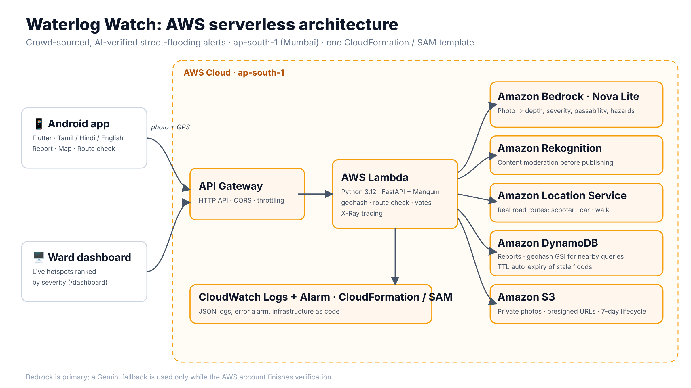

# Waterlog Watch 🌧️

**Crowd-sourced, AI-verified street flooding alerts for Indian cities.**
Built for the Bharat Builds Tour, Environmental Hacks: **Heat and Water** track.

**Live on AWS (ap-south-1):** API `https://lwj4clgh53.execute-api.ap-south-1.amazonaws.com` · [Ward dashboard](https://lwj4clgh53.execute-api.ap-south-1.amazonaws.com/dashboard) · [API docs](https://lwj4clgh53.execute-api.ap-south-1.amazonaws.com/docs)

> **Note:** our AWS account is still finishing verification, which currently blocks Amazon Bedrock at the account
> level. The backend tries Bedrock first and falls back to Gemini only if Bedrock refuses. Each report records which
> model was used (`ai_provider`), and Bedrock takes over automatically once the account is verified.

Every monsoon, Chennai, Mumbai, Bengaluru and Delhi commuters drive into knee-deep water with no warning.
Two-wheelers stall, people fall into hidden open drains, and ambulances get stuck. Official flood maps are
coarse, and WhatsApp forwards are unverified and outdated.

Waterlog Watch turns every phone into a flood sensor:

1. **Snap**: a citizen photographs a waterlogged street.
2. **Verify**: Amazon Bedrock looks at the photo and estimates water depth (ankle, knee, waist), a severity
   from 1 to 5, who can pass (walking, two-wheeler, car) and hazards such as open drains or live wires.
   Non-flood photos are rejected, which blocks spam.
3. **Warn**: the spot appears on a live map for everyone nearby, with a summary in **Tamil, Hindi or English**.
4. **Route check**: long-press your destination and see whether your way is safe ("Avoid", "Caution" or "Clear").
5. **Self-healing**: neighbours tap *Still flooded* or *Cleared*. Cleared spots disappear, and stale reports
   expire automatically through DynamoDB TTL.
6. **Ward command dashboard**: a live web dashboard (`/dashboard`) ranks hotspots by severity so officers know
   where to send pumps first.
7. **Safety first**: one-tap calls to 112 and the Chennai Corporation flood helpline (1913), plus monsoon safety tips.

The full app UI is available in **Tamil, Hindi and English**, with first-launch onboarding.



## Architecture (100% AWS serverless)

```
Flutter app ──HTTPS──> Amazon API Gateway (HTTP API, throttled)
                              │
                              ▼
                       AWS Lambda (Python 3.12, FastAPI + Mangum)
                        │            │                 │
                        ▼            ▼                 ▼
               Amazon Bedrock   Amazon S3         Amazon DynamoDB
               (Nova Lite,      (photos, private,  (reports, geohash GSI
                Converse API,    presigned URLs,    for nearby queries,
                multimodal)      7-day lifecycle)   TTL auto-expiry)
                        ▲
               Amazon Rekognition (content moderation before anything goes public)

        Observability: CloudWatch Logs (JSON) + error alarm · AWS X-Ray tracing
```

All infrastructure is defined in [`template.yaml`](template.yaml) (AWS SAM) and deploys with one command.

| AWS service | What it does here |
|---|---|
| **Amazon Bedrock** (Amazon Nova Lite) | Reads the flood photo and returns structured JSON: depth, severity, passability, hazards, plus a summary in the user's language |
| **AWS Lambda** | Runs the FastAPI backend, scaling to zero |
| **Amazon API Gateway** | HTTPS API with CORS and rate limiting |
| **Amazon DynamoDB** | Stores reports. A geohash GSI finds nearby spots; TTL removes stale floods |
| **Amazon S3** | Private photo storage with presigned URLs and auto-deletion after 7 days |
| **Amazon Rekognition** | Blocks unsafe or explicit images before they are posted publicly |
| **Amazon Location Service** | Real road routes (scooter, car, walking) for the route check |
| **Amazon CloudWatch + AWS X-Ray** | Structured JSON logs, an error alarm, and end-to-end request tracing |
| **AWS SAM / CloudFormation** | Infrastructure as code |

## API

| Method | Path | Purpose |
|---|---|---|
| POST | `/reports` | Photo + GPS → Bedrock assessment → stored. Reports within 75 m merge into one spot |
| GET | `/reports/nearby?lat&lng&radius_km` | Active spots, most severe first |
| POST | `/reports/{id}/vote` | `still_there` or `cleared` (one vote per device). 3 or more "cleared" votes close the spot |
| GET | `/route-check?from_lat&from_lng&to_lat&to_lng` | Flooded spots near your route, with a verdict |
| GET | `/stats?lat&lng` | Counts for a neighbourhood |
| GET | `/dashboard?lat&lng&radius_km` | Live ward command dashboard (HTML) |

Interactive docs: `<ApiUrl>/docs`

## Run it

### 1. Deploy the backend
**With AWS CloudShell / SAM CLI:**
```bash
git clone https://github.com/abinivesh-m/waterlog-watch.git && cd waterlog-watch
pip3 install -r backend/requirements.txt -t backend/ --platform manylinux2014_x86_64 --python-version 3.12 --only-binary=:all:
sam deploy --template-file template.yaml --stack-name waterlog-watch --region ap-south-1 --resolve-s3 \
  --capabilities CAPABILITY_IAM CAPABILITY_AUTO_EXPAND
```
**Without a shell (how we deployed):** zip `backend/` together with its dependencies (Linux, Python 3.12), upload it to an S3
bucket, then create a CloudFormation stack from `template.yaml`, with `CodeUri` pointing at that S3 object.

Copy the `ApiUrl` output.

### 2. Build the Android app
```powershell
cd app
powershell -ExecutionPolicy Bypass -File .\setup_android.ps1    # first time only
flutter build apk --release --dart-define=API_URL=<ApiUrl>
```

### Demo data (for recording when it isn't raining)
```bash
python scripts/seed_demo.py          # 12 labelled [Demo] spots around Chennai, expire in 6 h
python scripts/seed_demo.py --clear  # remove them
```

### Backend tests (AWS mocked with moto)
```bash
cd backend && pip install -r requirements-dev.txt && pytest -q
```

## Docs
- [Demo video script](docs/DEMO_SCRIPT.md)
- [Submission write-up](docs/WRITEUP.md)

## What's next
- SMS/WhatsApp alerts for subscribed streets (Amazon SNS / Pinpoint)
- A ward-level dashboard for the Greater Chennai Corporation to dispatch pumps (Amazon QuickSight)
- Merge with IMD rain forecasts to predict which streets will flood before the rain arrives

## Team
Abinivesh M

## AI tools used
Designed and built by Abinivesh M. Used Claude for coding assistance.
